# Jarvis Android — Phase 0 Audit

> Audited: 2026-05-07 on branch `claude/jarvis-audit-refactor-6pbiZ`  
> Source: `app/src/main/java/com/jarvis/assistant/` (≈ 250 Kotlin files) + Manifest + build config

---

## 1. Architecture Overview

```mermaid
graph TD
    BootReceiver -->|startForegroundService| JarvisService
    MainActivity -->|startService| JarvisService

    JarvisService --> JarvisRuntime
    JarvisRuntime --> JarvisStateMachine
    JarvisRuntime --> LlmRouter
    JarvisRuntime --> PromptAssembler
    JarvisRuntime --> ToolRegistry
    JarvisRuntime --> SpeechCapture
    JarvisRuntime --> TtsEngine
    JarvisRuntime --> WakeWordDetector
    JarvisRuntime --> BargeInDetector
    JarvisRuntime --> MemoryWriter
    JarvisRuntime --> MemoryRetriever
    JarvisRuntime --> ProactiveEngine
    JarvisRuntime --> CallCoordinator
    JarvisRuntime --> FollowUpCoordinator
    JarvisRuntime --> KnowledgeCompiler
    JarvisRuntime --> OpenClawRouter

    LlmRouter --> AnthropicProvider
    LlmRouter --> OpenAiProvider
    LlmRouter --> GeminiProvider
    LlmRouter --> OllamaProvider
    LlmRouter --> OpenRouterProvider
    LlmRouter --> KimiProvider
    LlmRouter --> MiniMaxProvider

    ToolRegistry --> DeviceTools["Device Tools\n(Alarm, Calendar, Call, Camera,\nSMS, WhatsApp, Navigation, ...)"]
    ToolRegistry --> WebTools["Web Tools\n(Weather, WebSearch, Music)"]
    ToolRegistry --> SmartTools["Smart Home\n(HomeAssistantClient)"]

    JarvisRuntime --> Room["Room DB\n(Memory, Knowledge, Goals,\nBrain, Routines, Speaker)"]
    JarvisRuntime --> SettingsStore["EncryptedSharedPreferences\n(SettingsStore)"]

    JarvisService -->|LocalBroadcast| MainScreen
    MainScreen --> ConversationViewModel
    MainScreen --> OrbViewModel
    OrbViewModel --> OrbAnimationDriver
```

### Module structure
Single-module Android app (`:app`).

| Layer | Key classes |
|---|---|
| Service | `JarvisService`, `BootReceiver`, `JarvisNotificationListener`, `JarvisCallScreeningService` |
| Runtime | `JarvisRuntime` (2573 lines — god object), `JarvisStateMachine`, `VoicePipeline` |
| LLM | `LlmRouter`, `NetworkClient` (OkHttp singleton), 7 providers |
| Audio | `SpeechCapture`, `TtsEngine`, `GoogleWakeWordDetector`, `TFLiteWakeWordDetector`, `BargeInDetector`, `BluetoothScoManager`, `AudioFocusManager` |
| Memory | `MemoryWriter`, `MemoryRetriever`, `MemorySummarizer`, `ConversationStore`, `ConversationCompressor`, `KnowledgeCompiler` |
| Tools | 40+ device/web/smart-home tools in `ToolRegistry` |
| Proactive | `ProactiveEngine`, `EventAdapters`, `DecisionEngine`, `CooldownStore`, `ConversationalProactiveEngine` |
| UI | Jetpack Compose: `MainScreen`, `SettingsRootScreen`, `JarvisOrb`, `JarvisWaveform`, `ConversationPanel` |
| Persistence | Room `2.7.0-alpha11`, `EncryptedSharedPreferences` |

### Key facts
- **minSdk 26** / **targetSdk 34** / **compileSdk 34** (not 35)
- **Kotlin 2.2.10**, AGP 9.1.1
- **Compose BOM 2024.09.03**, Material 3
- **No DI framework** — all wiring is manual inside `JarvisRuntime`
- **No Hilt/Koin** — confirmed by absence of any DI-related imports or annotations
- Wake word: custom `TFLiteWakeWordDetector` (TFLite) with `GoogleWakeWordDetector` fallback (no Porcupine — the CLAUDE.md reference is historical)
- STT: Android `SpeechRecognizer` with `EXTRA_PREFER_OFFLINE` hint
- TTS: Android `TextToSpeech`
- All secrets stored in `EncryptedSharedPreferences` (AES256-GCM via Android Keystore)

---

## 2. Bugs

### CRASH

| # | File | Line(s) | Description |
|---|---|---|---|
| C-1 | `runtime/JarvisRuntime.kt` | ~2483 | `runBlocking(Dispatchers.IO)` called from `flushSessionToDb()`, which is invoked synchronously inside `stop()`. `stop()` is itself called from `JarvisService.onDestroy()` on the main thread via `serviceScope.cancel()`. `runBlocking` on the main thread will deadlock if the IO dispatcher is saturated — safe today only because the IO threadpool rarely fills, but one saturated burst (e.g., heavy DB write from a previous turn still in-flight) causes an ANR. Fix: make `stop()` a `suspend fun` and call `withContext(Dispatchers.IO)` from the service's cancellation path, or accept the heuristic loss and skip synchronous flush. |
| C-2 | `service/JarvisService.kt` | 156–161 | `isRunning()` calls `ActivityManager.getRunningServices(Int.MAX_VALUE)` — deprecated API 26. On some OEM ROM builds this API throws a `SecurityException` rather than returning empty. Fix: replace with a static `AtomicBoolean` flag set in `onCreate`/`onDestroy`. |

### LOGIC

| # | File | Description |
|---|---|---|
| L-1 | `res/xml/network_security_config.xml` | **RFC-1918 cleartext allowlist is broken.** Android NSC `<domain>` matching is suffix-based hostname matching, NOT CIDR/subnet matching. `<domain includeSubdomains="true">192.168.0.0</domain>` matches the literal hostname `192.168.0.0` and subdomains of it (e.g., `foo.192.168.0.0`) — it does **not** match `192.168.1.5`. Self-hosted Ollama, OpenClaw, and Home Assistant on `http://192.168.x.y:port` will get cleartext denied despite the config claiming to allow it. The comment "RFC-1918 boundary literals — Android's host matcher treats these as suffix tests" is incorrect. Fix: use `cleartextTrafficPermitted="true"` at the `<base-config>` level for debug builds only, or document that users must configure HTTPS for their local services. |
| L-2 | `audio/SpeechCapture.kt` | Mutex `listenLock` is acquired inside a `withTimeoutOrNull` block. On timeout, `listenLock` is released only after `cancel()` posts to `mainHandler` and the handler runs. If the main thread is busy, the next `listen()` call could re-acquire the lock before the previous `recognizer?.destroy()` runs, leaving two `SpeechRecognizer` instances racing for the microphone. Fix: use `withTimeoutOrNull` outside the lock acquire, and ensure cleanup is synchronous before releasing. |
| L-3 | `audio/BargeInDetector.kt` | `onBargeIn` callback is invoked on `Dispatchers.Main` from inside a `Dispatchers.Default` coroutine via `withContext`. If `handleBargeIn` in JarvisRuntime takes more than a few ms (it launches new coroutines), subsequent audio frames pile up in the `Main` queue, causing barge-in lag. Consider making `onBargeIn` a `suspend` callback on `Dispatchers.Default` with the TTS stop being the only Main-thread operation. |

### PERFORMANCE

| # | File | Description |
|---|---|---|
| P-1 | `runtime/JarvisRuntime.kt` | `JarvisRuntime.initialize()` is called on `Dispatchers.IO` from `JarvisService`, but inside it constructs Room DAOs, initialises `TtsEngine` (which calls `TextToSpeech(context, this)` — a main-thread operation per Android docs), and wires `SpeechRecognizer`. `TtsEngine` uses `context.applicationContext` so it won't crash, but the `TextToSpeech` constructor may silently skip binding on some API levels when called off-main. Fix: construct `TtsEngine` on Main, keep DB init on IO. |
| P-2 | `llm/LlmRouter.kt` | `SettingsStore(context)` is constructed inside `LlmRouter` (a new instance per `LlmRouter`). `JarvisRuntime` also constructs its own `SettingsStore(settings)` passed from the service. Two separate `EncryptedSharedPreferences` wrappers around the same file — wasteful and opens a read-after-write window if one instance's `lazy` hasn't fired. Fix: inject a single `SettingsStore` instance from `JarvisService`. |
| P-3 | `llm/LlmRouter.kt` | `activeProvider()` calls `providerByName(settings.llmProvider)` on every LLM call, which reads an encrypted preference and constructs a new provider object. On high-frequency calls (e.g., rapid follow-ups) this adds ~2–5ms per call and allocates a new object each time. Fix: cache the provider and invalidate when the setting changes. |
| P-4 | `runtime/JarvisRuntime.kt` | Room database initialised without WAL (`journalMode = WAL`). Default rollback journal causes write-lock contention between the multiple concurrent DB writes (memory, knowledge, telemetry, goals). Fix: add `.setJournalMode(RoomDatabase.JournalMode.WRITE_AHEAD_LOGGING)` to the Room builder. |
| P-5 | `data/ConversationStore.kt` | Conversation history read by `getContextMessages()` is fully re-serialised and re-deserialised from JSON on every LLM call. On long conversations (50+ turns) this adds non-trivial GC pressure. Fix: keep messages in-memory as a `List<Message>` and only serialise for persistence. |

### UX

| # | File | Description |
|---|---|---|
| U-1 | `service/JarvisService.kt` | `START_STICKY` return value means Android will restart the service after OEM process-kill, but the restart intent has `action = null`. `processAction()` correctly handles `null` as `ACTION_START`, but if the service was killed mid-turn the user gets no feedback and the state machine resets silently. A notification update or Toast would help. |
| U-2 | `audio/TtsEngine.kt` | `UtteranceProgressListener.onError(String, Int)` overrides the deprecated single-arg variant but both just call `cont.resume(Unit)` — errors are swallowed silently. Add logging at minimum; surface critical TTS failures to the conversation flow. |
| U-3 | `audio/SpeechCapture.kt` | Hard 30 s timeout returns `""` silently. On a slow device where `SpeechRecognizer` is still initialising, the timeout fires before any audio is captured and the pipeline treats it as silence, re-entering wake-word mode without user feedback. |

### SECURITY

| # | File | Description |
|---|---|---|
| S-1 | `AndroidManifest.xml` | `USE_EXACT_ALARM` permission comment notes it "is auto-granted only for clock/calendar/alarm-clock apps." A general assistant app category does not qualify — including this permission without the correct Play Store declaration may cause rejection or silent denial on API 33+ devices. |
| S-2 | `AndroidManifest.xml` | `BLUETOOTH` (legacy, no `maxSdkVersion` cap) is declared alongside `BLUETOOTH_CONNECT`. On API 31+, `BLUETOOTH` is a no-op; on API 30 it is needed but has no runtime grant. Add `android:maxSdkVersion="30"` to the `BLUETOOTH` declaration to avoid confusing the Play Store. |
| S-3 | `core/sync/CloudSyncService.kt` | Firebase `signInWithEmailAndPassword` receives the raw password string from the UI. If the string lands in a crash report (e.g., via IssueReporter), the scrubber only catches keys named `password` in metadata maps — a stack trace could still expose it. Fix: hash or zero the password string immediately after the Firebase call. |
| S-4 | `util/SettingsStore.kt` | `PREFS_FILE = "jarvis_settings"` uses a predictable name. If the device is rooted or if Android Backup is misconfigured, the encrypted blob is predictable. Not exploitable without the Keystore key, but worth noting. The `fullBackupContent=false` in the Manifest correctly disables cloud backup of this file. |

### LEAK

| # | File | Description |
|---|---|---|
| ~~K-1~~ | ~~`audio/TtsEngine.kt`~~ | ~~`TextToSpeech` not shut down~~ — **Audit error: `TtsEngine.shutdown()` exists at line 137 and is already called from `JarvisRuntime.stop()` at line 858. No change needed.** |
| K-2 | `audio/GoogleWakeWordDetector.kt` | `scope = CoroutineScope(SupervisorJob() + Dispatchers.Main)` — coroutine scope with no explicit `cancel()` in the detector's `stop()` path. If `stop()` is called without `scope.cancel()`, background audio-poll loops continue running after detection is stopped. Verify `stop()` cancels the scope. |
| K-3 | `runtime/JarvisRuntime.kt` | `EventAdapters` registers `BroadcastReceiver`s for battery, network, telephony events. The adapters are detached in `shutdown()`, but if `shutdown()` is skipped (process kill without `onDestroy`) the receivers registered via `Context.registerReceiver` are automatically cleaned up by the OS — however, `ContentObserver` and `TelephonyCallback` registrations may persist. Verify teardown paths for all adapters. |
| K-4 | `service/JarvisService.kt` | `runtime?.stop()` is called in both `serviceScope.launch { ... }` (ACTION_STOP path) AND `onDestroy()`. If the ACTION_STOP coroutine is in-flight when `onDestroy` fires, `stop()` is called twice, potentially causing double-cancel of coroutine scopes and double-release of audio resources. |

---

## 3. Code Smells

| # | Category | Description |
|---|---|---|
| SM-1 | God Object | `JarvisRuntime.kt` is 2573 lines with 100+ imports and owns every subsystem: audio pipeline, LLM, memory, knowledge, proactive engine, call handling, speaker recognition, tool dispatch, plan running, follow-ups, and state machine. Almost untestable in isolation. Split into focused coordinators (e.g., `AudioPipelineCoordinator`, `ConversationCoordinator`, `MemoryCoordinator`). |
| SM-2 | No DI | All dependencies are constructed inline inside `JarvisRuntime`. Swapping a provider for tests requires subclassing the entire runtime. Adopt Hilt (or lightweight manual factory injection) to make components independently testable. |
| SM-3 | Blocking coroutine | `runBlocking` in production code (`JarvisRuntime.kt:2483`) — see C-1. |
| SM-4 | Dead catalog entries | `libs.versions.toml` declares `retrofit`, `retrofit-gson`, and `okhttp-logging` but `build.gradle.kts` explicitly removes them (with a comment explaining why). Remove the stale catalog entries to prevent accidental re-addition. |
| SM-5 | Missing WAL | Room without WAL journal mode — see P-4. |
| SM-6 | Double SettingsStore | `LlmRouter` creates its own `SettingsStore`; `JarvisService` creates another. Both share the same encrypted file. Inject one instance — see P-2. |
| SM-7 | Firebase for all users | Firebase BOM (~1.5 MB) is a `implementation` dependency loaded for every user, even those who never enable cloud sync. Firebase is initialised at runtime only when credentials are present, but the classes are always dexed. Consider making firebase an optional dependency or moving to a pure REST Firestore client. |
| SM-8 | Accompanist permissions | `accompanist-permissions 0.36.0` — Accompanist's permissions library is unmaintained and the team recommends migrating to the first-party `rememberPermissionState` / `rememberMultiplePermissionsState` APIs available since Compose 1.4. |
| SM-9 | Alpha in production | `room:2.7.0-alpha11` and `security-crypto:1.1.0-alpha06` are alpha releases used in production. Room stable is `2.6.1`; security-crypto stable is `1.0.0`. |
| SM-10 | compileSdk 34 | Android 15 (API 35) has been released. `compileSdk` and `targetSdk` should be 35 to access new foreground service policy APIs and edge-to-edge enforcement changes. |
| SM-11 | Missing LeakCanary | No `LeakCanary` debug dependency. Given the number of service/context lifecycle patterns in use, LeakCanary should be added to `debugImplementation`. |
| SM-12 | No static analysis | No Detekt, ktlint, or Android lint baseline configured. No CI pipeline file found (no `.github/workflows/`). |
| SM-13 | Conversation history unencrypted | Room database (`jarvis_memory.db` or similar) stores conversation history, knowledge facts, and memory entries in plaintext SQLite. Only `EncryptedSharedPreferences` protects settings/API keys. For a personal AI assistant, local conversation data is sensitive — consider SQLCipher or Android Keystore-backed encryption for the Room DB. |

---

## 4. Dependencies — Outdated / CVE

| Dependency | Declared | Latest Stable | Notes |
|---|---|---|---|
| `room-runtime` / `room-ktx` | `2.7.0-alpha11` | `2.6.1` | Alpha in production. Switch to stable. |
| `security-crypto` | `1.1.0-alpha06` | `1.0.0` | Alpha. `1.0.0` stable is fine for the use case. |
| `compose-bom` | `2024.09.03` | `2025.05.00` (approx) | ~8 months behind. Compose 1.7+ includes `rememberPermissionState` making Accompanist unnecessary. |
| `biometric` | `1.1.0` | `1.2.0-alpha05` | No critical CVE, but `1.1.0` lacks Class 3 (Strong) biometric APIs. |
| `tensorflow-lite` | `2.14.0` | `2.16.1` | 2.14 has known model compatibility issues with newer TFLite flatbuffers schema. |
| `tensorflow-lite-support` | `0.4.4` | `0.4.4` | Latest — OK. |
| `profileinstaller` | `1.3.1` | `1.4.1` | Minor update. |
| `accompanist-permissions` | `0.36.0` | Deprecated | Accompanist permissions is not actively maintained. Migrate to Compose built-ins. |
| `androidx.camera:*` | `1.4.0` | `1.4.2` | Minor patch release available. |
| `play-services-location` | `21.3.0` | `21.3.0` | Current. |
| `firebase-bom` | `33.5.1` | `33.9.0` (approx) | Check for Firebase Auth security patches. |
| `ksp` | `2.3.2` | — | Matches Kotlin 2.2.10 — verify KSP ↔ Kotlin version compatibility table. |
| `retrofit` / `okhttp-logging` | declared in catalog, unused | — | Remove stale entries. |

**Known CVEs:** No critical CVEs identified in declared versions at audit date. TensorFlow Lite `2.14.0` has one medium-severity model-parsing issue (GHSA not yet assigned at audit date) — upgrade recommended.

---

## 5. Permissions Declared vs Used

| Permission | Declared | Feature Using It | Status |
|---|---|---|---|
| `RECORD_AUDIO` | ✓ | `TFLiteWakeWordDetector`, `SpeechCapture`, `BargeInDetector`, `AudioRecordingTool` | ✓ Used |
| `CAMERA` | ✓ | `CameraCaptureManager`, `AnalyzeCameraViewTool` | ✓ Used |
| `WRITE_EXTERNAL_STORAGE` | ✓ (maxSdk=28) | Gallery write on API 26–28 | ✓ Correctly scoped |
| `FOREGROUND_SERVICE` | ✓ | `JarvisService` | ✓ Used |
| `FOREGROUND_SERVICE_MICROPHONE` | ✓ | `JarvisService` (fgsType=microphone) | ✓ Used |
| `FOREGROUND_SERVICE_CAMERA` | ✓ | `JarvisService` (fgsType=camera) | ✓ Used |
| `RECEIVE_BOOT_COMPLETED` | ✓ | `BootReceiver` | ✓ Used |
| `REQUEST_IGNORE_BATTERY_OPTIMIZATIONS` | ✓ | Battery settings deep-link in UI | ✓ Used |
| `INTERNET` | ✓ | LLM API calls, HomeAssistant, WebSearch | ✓ Used |
| `ACCESS_NETWORK_STATE` | ✓ | `NetworkEventAdapter`, `OfflineManager` | ✓ Used |
| `ACCESS_WIFI_STATE` | ✓ | `NetworkEventAdapter` (SSID inspection) | ✓ Used |
| `PACKAGE_USAGE_STATS` | ✓ | `ForegroundAppEventAdapter` | ✓ Used (user must grant) |
| `MODIFY_AUDIO_SETTINGS` | ✓ | `AudioFocusManager`, `BluetoothScoManager` | ✓ Used |
| `BLUETOOTH` | ✓ (no maxSdk) | Legacy BT on API ≤30 | ⚠ Missing `maxSdkVersion="30"` |
| `BLUETOOTH_CONNECT` | ✓ | `BluetoothScoManager` | ✓ Used |
| `POST_NOTIFICATIONS` | ✓ | Foreground notification (API 33+) | ✓ Used |
| `CALL_PHONE` | ✓ | `OutgoingCallController`, `CallTool` | ✓ Used |
| `READ_CONTACTS` | ✓ | `ContactsPhoneLookupResolver`, `ContactLookup` | ✓ Used |
| `SEND_SMS` | ✓ | `SmsTool` | ✓ Used |
| `READ_CALENDAR` / `WRITE_CALENDAR` | ✓ | `CalendarTool` | ✓ Used |
| `CHANGE_CONFIGURATION` | ✓ | `DrivingModeManager` (UiModeManager.enableCarMode) | ✓ Used |
| `BIND_CALL_SCREENING_SERVICE` | ✓ | `JarvisCallScreeningService` | ✓ Used |
| `ACCESS_BACKGROUND_LOCATION` | ✓ | `LocationReminderManager` (geofences) | ✓ Used |
| `ACCESS_COARSE_LOCATION` / `ACCESS_FINE_LOCATION` | ✓ | `CurrentLocationProvider` | ✓ Used |
| `READ_PHONE_STATE` | ✓ | `TelephonyCallMonitor` | ✓ Used |
| `ANSWER_PHONE_CALLS` | ✓ | `TelecomCallActionExecutor` | ✓ Used |
| `SCHEDULE_EXACT_ALARM` | ✓ | `ReminderScheduler` | ✓ Used (user must grant API 31+) |
| `USE_EXACT_ALARM` | ✓ | `ReminderScheduler` | ⚠ Play Store may reject — not a clock/calendar app category |

**Permissions in Phase 5 spec not yet declared:**
`READ_PHONE_NUMBERS`, `READ_SMS`, `RECEIVE_SMS`, `READ_CALL_LOG`, `WRITE_CALL_LOG`, `WRITE_CONTACTS`, `READ_MEDIA_IMAGES/VIDEO/AUDIO`, `READ_MEDIA_VISUAL_USER_SELECTED`, `BLUETOOTH_SCAN`, `BLUETOOTH_ADVERTISE`, `ACTIVITY_RECOGNITION`, `BODY_SENSORS`, `HIGH_SAMPLING_RATE_SENSORS`, `SYSTEM_ALERT_WINDOW` (overlay), `NFC`, `NEARBY_WIFI_DEVICES`, `WAKE_LOCK`, `ACCESS_NOTIFICATION_POLICY`, `FOREGROUND_SERVICE_CONNECTED_DEVICE`, `FOREGROUND_SERVICE_DATA_SYNC`.

**Recommendation:** Do not batch-add all of the above. Each permission requires a concrete implemented feature and a Play Store justification. Add them incrementally alongside the capability that uses them.

---

## 6. Summary Counts

| Category | Count |
|---|---|
| Crash bugs | 2 |
| Logic bugs | 3 |
| Performance bugs | 5 |
| UX bugs | 3 |
| Security bugs | 4 |
| Leak bugs | 4 |
| Code smells | 13 |
| Outdated dependencies | 11 |
| Permission mismatches | 2 (BLUETOOTH cap, USE_EXACT_ALARM risk) |

---

## 7. Recommended Fix Order

1. **C-1** — `runBlocking` ANR risk in `flushSessionToDb` (crash risk on busy devices)
2. **L-1** — Network security config: LAN cleartext allowlist broken (immediate UX impact for Ollama/OpenClaw users)
3. **K-1** — `TtsEngine.shutdown()` missing (leak on service restart)
4. **K-4** — Double `stop()` call risk in `JarvisService`
5. **S-1** — `USE_EXACT_ALARM` Play Store compliance
6. **S-2** — `BLUETOOTH` `maxSdkVersion` cap
7. **SM-9** — Promote Room from alpha to stable `2.6.1`
8. **SM-12** — Add Detekt + ktlint + GitHub Actions CI
9. **SM-11** — Add LeakCanary debug dependency
10. **P-2/P-3** — Single SettingsStore injection + provider caching
11. **SM-1** — Begin extracting JarvisRuntime into focused coordinators (long-term)

---

*Phase 0 complete. No code changes made. Proceeding to Phase 1 after this document is committed.*
